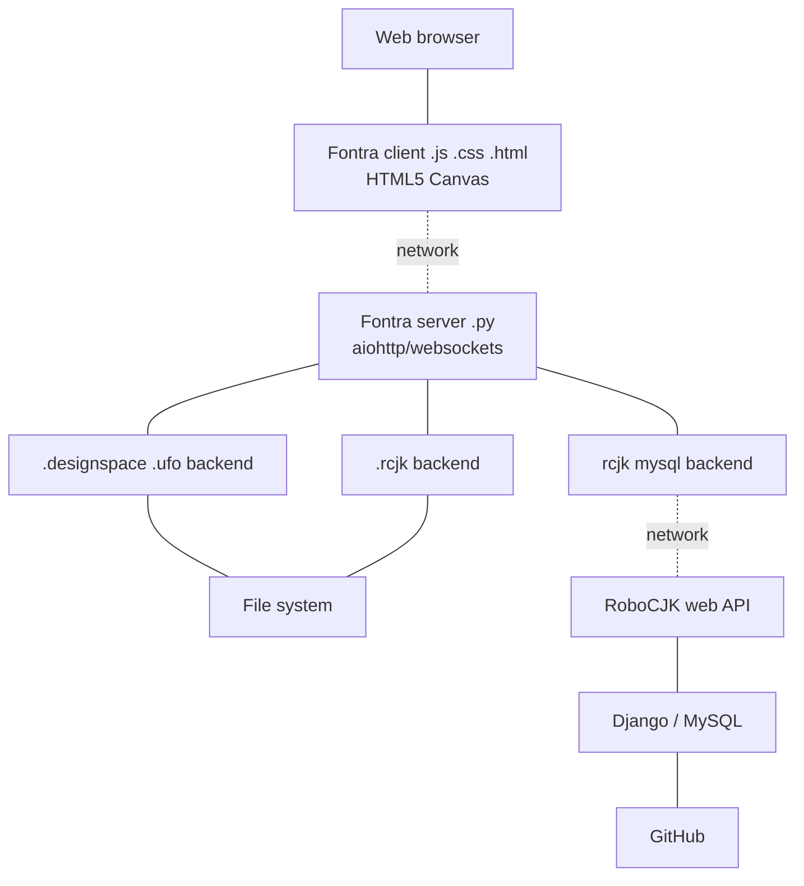

# Fontra

- checkout the repo, cd into the root of the repo

- create a Python venv in the root of the repo:

    `python3 -m venv venv --prompt=fontra`

- activate venv:

    `source venv/bin/activate`

- install dependencies:

    `pip install --upgrade pip`

    `pip install -r requirements.txt`

    `pip install -e .`

- start the fontra server with a path to a folder containing fonts (.rcjk, .designspace or .ufo), using `--filesystem-root`:

    `fontra --filesystem-root /path/to/a/folder`

- or a start it with a robocjk server hostname, using `--rcjk-host`:

    `fontra --rcjk-host some-robocjk-server.some-domain.com`

- then navigate to:

    `http://localhost:8000/`

## Block diagram

