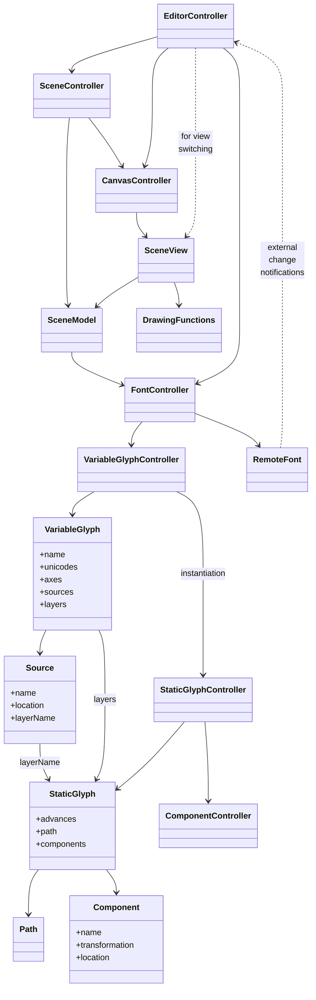

### UI Controllers

- EditorController
- SceneController
- CanvasController

### UI Model/View

- SceneModel
- SceneView

### Misc UI

- List
- Sliders

### Model Controllers

- FontController
- VariableGlyphController
- StaticGlyphController
- ComponentController

### Model Objects

- VariableGlyph
- StaticGlyph
- VarPath
- VarArray

### Misc Objects

- VariationModel
- Transform

### Client/Server Interaction

- RemoteObject

