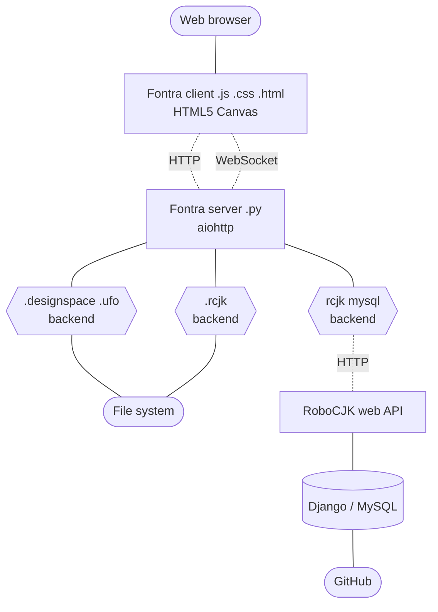
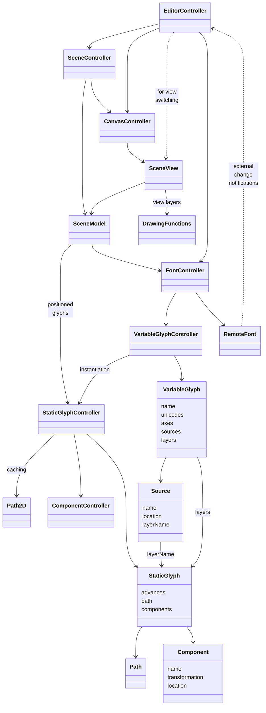
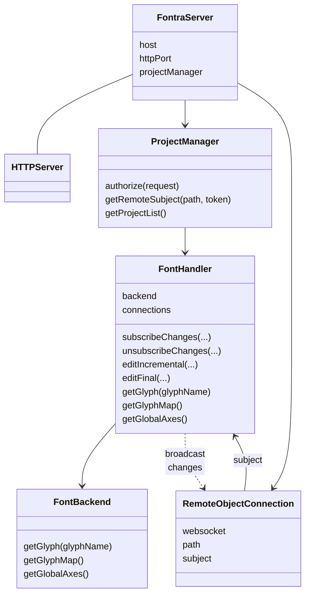

## Fontra Block Diagram

```mermaid
flowchart
  browser([Web browser])---client[Fontra client .js .css .html<br>HTML5 Canvas]
  client-.HTTP.-server[Fontra server .py<br>aiohttp]
  client-.WebSocket.-server
  server---ds{{.designspace .ufo<br>backend}}
  server---rcjk{{.rcjk<br>backend}}
  server---rcjk_mysql{{rcjk mysql<br>backend}}
  ds---fs([File system])
  rcjk---fs
  rcjk_mysql-.HTTP.-rcjk_server[RoboCJK web API]
  rcjk_server---django[(Django / MySQL)]
  django---git([GitHub])
```

## Fontra Client Object Relationships (JavaScript)

```mermaid
classDiagram
class VariableGlyph {
  name
  unicodes
  axes
  sources
  layers
}

class Source {
  name
  location
  layerName
}

class StaticGlyph {
  advances
  path
  components
}

class Component {
  name
  transformation
  location
}
EditorController-->SceneController
EditorController-->CanvasController
EditorController..>SceneView : for view<br>switching
EditorController-->FontController

CanvasController-->SceneView

SceneController-->SceneModel
SceneController-->CanvasController

SceneView-->SceneModel
SceneView-->DrawingFunctions : view layers

SceneModel-->StaticGlyphController : positioned<br>glyphs
SceneModel-->FontController

FontController-->VariableGlyphController
FontController-->RemoteFont

VariableGlyphController-->StaticGlyphController : instantiation
VariableGlyphController-->VariableGlyph

VariableGlyph-->Source
VariableGlyph-->StaticGlyph : layers
Source-->StaticGlyph : layerName
StaticGlyphController-->Path2D : caching
StaticGlyphController-->ComponentController
StaticGlyphController-->StaticGlyph


StaticGlyph-->Path
StaticGlyph-->Component

RemoteFont..>EditorController : external<br>change<br>notifications
```

## Fontra Server Object Relationships (Python)

```mermaid
classDiagram

class FontraServer {
  host
  httpPort
  projectManager
}

class RemoteObjectConnection {
  websocket
  path
  subject
}

class ProjectManager {
  authorize(request)
  getRemoteSubject(path, token)
  getProjectList()
}

class FontHandler {
  backend
  connections
  subscribeChanges(...)
  unsubscribeChanges(...)
  editIncremental(...)
  editFinal(...)
  getGlyph(glyphName)
  getGlyphMap()
  getGlobalAxes()
}

class FontBackend {
  getGlyph(glyphName)
  getGlyphMap()
  getGlobalAxes()
}

FontraServer -- HTTPServer
FontraServer --> ProjectManager
FontraServer --> RemoteObjectConnection

ProjectManager --> FontHandler
FontHandler --> FontBackend
FontHandler ..> RemoteObjectConnection : broadcast<br>changes

RemoteObjectConnection --> FontHandler : subject
```
