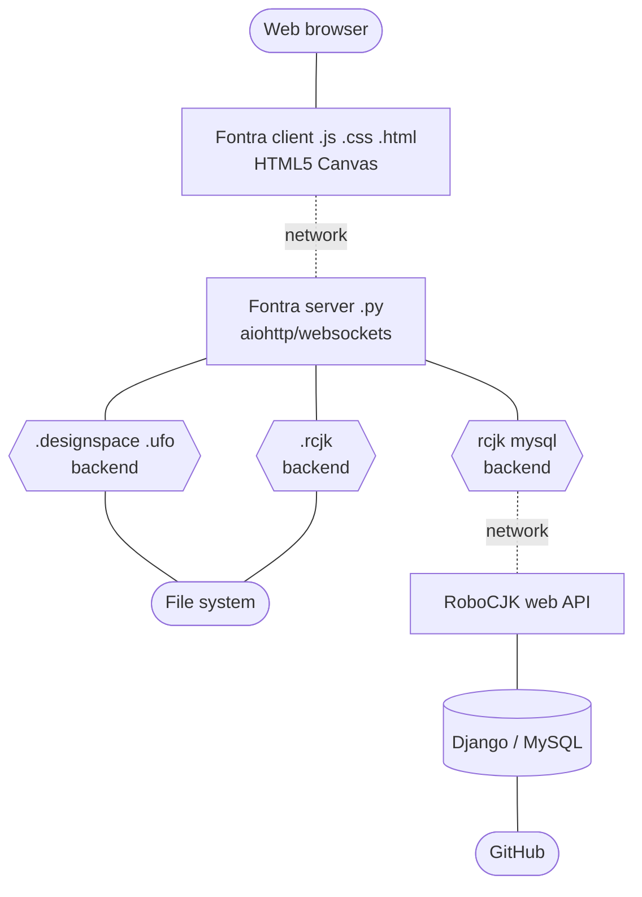

## Fontra Block Diagram



## Fontra Javascript Client Class Relationships


## Fontra Python Server Class Relationships

```mermaid
classDiagram

class FontraServer {
  host
  httpPort
  webSocketPort
  contentFolder
  templatesFolder
  projectManager
}

class WebSocketServer {
  subjectFactory
}

class WebSocketClient {
  path
  subjectFactory
}

class ProjectManager {
  requireLogin
  login(username, password)
  getRemoteSubject(path, token, remoteIP)
  getProjectList()
}

class FontHandler {
  getGlyph(glyphName)
  getReverseCmap()
  getGlobalAxes()
}

class FontBackend {
  getGlyph(glyphName)
  getReverseCmap()
  getGlobalAxes()
}

FontraServer -- HTTPServer
FontraServer -- WebSocketServer
FontraServer --> ProjectManager

ProjectManager --> FontHandler
FontHandler --> FontBackend
FontHandler ..> WebSocketClient : broadcast<br>changes

WebSocketServer --> ProjectManager
WebSocketServer --> WebSocketClient
